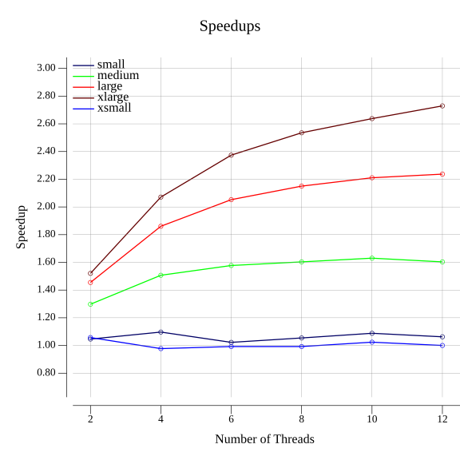
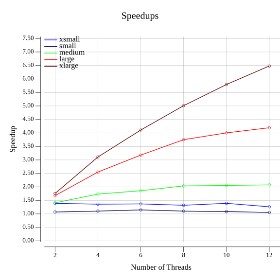
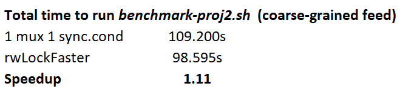
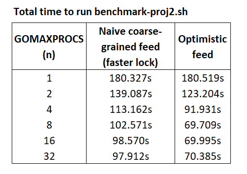
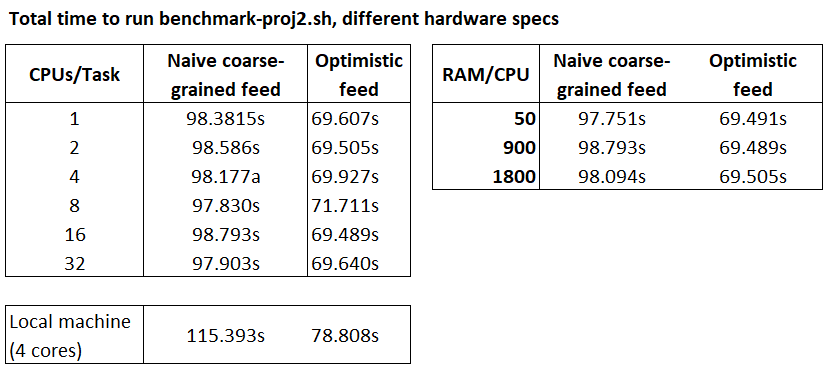

# Multithreaded Twiter Feed
In this project a multithreaded twitter feed was implemented using primitive parllel constructs only. 

# Outline 
- Setion 1 gives a summary of the project and sample runs

- Section 2 describes implementation details

- Section 3 describes usage

- Section 4 evaluates performance

# 1) Project description

In this project a server for a twitter feed was implemented using concurrent programming based on primitive parallel constructs and a simplified version of the producer-consumer model. In particular:
- The feed is implemented as a thread-safe linked list using a coarse-graind strategy and an RWLock implemented in this project using mutexes and condition variables only.
- The server listen for requests via `os.stdin` to add, remove, check for existence and return posts in the feed, sending responses back via `os.stdout`. All messaging follows JSON format.
- For the producer-consumer model, a non-blocking queue a la Michal-Scott was implemented that is populated by the producer with client requests and accessed concurrently by multiple threads/consumers executing requests.
- Two reader-write locks were implemented from scratch using condition variables and atomics
- A thread-safe queue for the feed was implemented using a simple blocking algorithm and an optimistic blocking strategy

## Sample run

After the script `proj2/twiter/twitter.go` is executed (see usage below), a client can provide commands in json format via `std.in` to add, remove and check posts in the feed, as well as retrieve the whole feed content. 

Here is an example of an execution and the format of each command:

```bash
go run proj2/twitter/twitter.go 4 < example.txt

Output:
{"success":true,"id":2}
{"success":false,"id":4}
{"success":true,"id":4}
{"id":5,"feed":[{"body":"Rainy days are the best","timestamp":43242442},{"body":"Just finished a great book","timestamp":43242441},{"body":"What a beautiful day!","timestamp":43242429},{"body":"This is a new tweet!","timestamp":43242428}]}
{"success":true,"id":1}
{"success":true,"id":3}
```
where `example.txt` contains the following commands:

```txt
{"command": "ADD", "id": 1, "body": "This is a new tweet!", "timestamp": 43242428}
{"command": "ADD", "id": 2, "body": "What a beautiful day!", "timestamp": 43242429}
{"command": "ADD", "id": 3, "body": "Just finished a great book", "timestamp": 43242441}
{"command": "ADD", "id": 4, "body": "Rainy days are the best", "timestamp": 43242442}
{"command": "REMOVE", "id": 4, "timestamp": 43242443}
{"command": "FEED", "id": 5}
{"command": "DONE", "id": 5}
```

I redirected a `.txt` file in the example above, but a client can simply send requests directly through the command line / os.stdin:

```bash
`go run proj2/twitter/twitter.go 4` < example.txt

Input: {"command": "ADD", "id": 1, "body": "This is a new tweet!", "timestamp": 43242428}
Output: {"success":true,"id":2}

Input: {"command": "REMOVE", "id": 2, "timestamp": 43242428}
Output: {"success":true,"id":2}

> # (continue receiving requests until "DONE" command is given)
```


# 2) Implementation
Below a brief description of the modules that composes this program and their implementation

### Reader/Writer lock
Module: `lock`

Scripts: `rwlock.go` and `rwlock_faster.go`

These two scripts implement a reader/writer lock using only mutexes and condition variables.

In ther RWLock:
- a maximum of 32 readers are allowed to acquire a reader lock
- one writer at a time is allowed to acquire a writer lock. Once a writer signals its interest in acquiring the lock, any reader that follows must wait the writer to acquire a reader lock (even if <32 active readers)

`rwlock.go` is a simpler implementation using only *one* lock and *one* condition variable
- This lock always give precedence to writers and hence, can starve readers if writers keep coming.

`rwlock_faster.go` is a more involved implementation using more than one condition variable to synchronize the readers and writers. It is more similar to the `Go` implementation using atomics. 
  - This lock is slightly faster than `rwlock.go` as it makes more sparse use of the mutexes and 
  - It also releases readers that come while a writer is writing, instead of always giving preference for writers.

### The feed
Module: `feed`

Scripts: `feed.go`, `feed.2go`

This module implements a data structure to hold twitter posts ordered from most recent to least recent, which we call `feed`.

- `feed.go`:
    -  implements the feed as a linked making use of the `RWLock` interface implemented in the `proj2/lock` module. It contains methods to add, remove, check for the existence of posts and return all the posts in the feed.
    -  The locking strategy is a naive coarse-grained one, where whenever a thread has to *modify* the feed ("ADD", "REMOVE"), a WRITER lock is taken and no other thread can access the feed. 
    - Although correct, this leads to a relevant sequential component even in the parallel implementation
    - More recent posts are closer to the head of the linked list.

- `feed2.go` have the same features as `feed.go`, but uses an "optimistic" locking strategy. Threads acquire READ locks to traverse the linked-list
and only acquire a WRITE lock when trying to update it. If the nodes relevant to the operation change while swapping locks, the thread retries the operation from the beginning.


### Sequential queue and non-blocking queue
Module: `queue`

Scripts: `queue.go`, `lockfree.go`

`queue.go` implements a simple sequential queue using a linked list.

`lockfree.go` implements a non-blocking queue a la Michael-Scott. It allows for multiple threads to enqueue, dequeue and read elements from the queue concurrently, without using locks.

Obs: due to limitations of Go's atomic operations, this queue is not safe for ABA-like problems. Nonetheless, they are very unlikely to happen in `Go` and for the current project in particular.

### Server 
Module: `server`

Scripts: `server.go`

This module:
- holds a twitter `feed` and reads requests for add, remove, contains posts to it and to return the content of the feed

- it reads requests from clients sent via `os.stdin` and return response to clients via `os.stdout`. The server runs indefinitely until the client send a "DONE" command (see examples in the general description section)

- It can operate in two modes 'sequential' and 'concurrent'

**Sequential**

Each request is read, parsed and executed by only one go routine, sequentially.

**Concurrent**

The server:
- Deploy multiple go routines = consumers and notify them whenever there are requests to be executed. 

- Deploy a `producer` in the main thread, which parse requests sent by clients via `std.in` and populates a non-blocking queue of tasks (producer).

- The go routines = consumers take tasks from the queue, execute and send response back to clients via `os.stdout`. 

- The server keeps listening for requests from clients, populating the queue and waking up consumers as requests comes in 

- Consumers keep retrieving tasks from the queue until it is empty

- Synchronization is implemented through condition variables (for consumers to wait and producer to signalize tasks are available) and a wait group (for producer to wait until all consumers finish when a "DONE" command is received.)

### Twitter executable

Usage: `go run twitter.go <number of threads>`

This script deploys the server to receive client requests.
- If number of threads > 1, the server is deployed in concurrent mode. I.e., the consumer-producer model as described in the `Server` section
- Otherwise, sequential mode. I.e., each task is parsed and executed by the *same* go routine.

# 3) Usage
For all that follows:

1) clone the repo by executing:

    `git clone https://github.com/mpcs-jh/project-2-mshalimay`

    This will create a folder named `project-2-mshalimay` that contains the root for the project `proj2`

2) Everything assumes scripts are executed in the UChicago CS servers, particularly by using `slurm`. The git repo should have already set a `slurm/out` directory for the outputs, but if you dont see one, you should create a folder `slurm/out` inside the `proj2` directory to hold the outputs from `sbatch`'s

## 3.1) Running twitter.go

Navigate to `proj2/twitter` and execute `go run twitter.go <number_of_threads>`

`number_of_threads`: the number of go routines to be deployed. If not given, the server will run in sequential mode.

Provide commands via the command line following the `example.txt` file inside `twitter` folder and described in *Section 1*.


## 3.2) Running grder/test scripts

1) Modify these lines inside `grader/benchmark-proj2.sh` and `grader-slurm.sh`
    ```bash
    #SBATCH --mail-user=<your_username>@cs.uchicago.edu

    #SBATCH --chdir=<path_to_project_root_directory>
    ```
    For instance, in my case the two lines are as below:
    ```bash
    #SBATCH --mail-user=mashalimay@cs.uchicago.edu
    #SBATCH --chdir=/home/mashalimay/ParallelProgramming/project-2-mshalimay/proj2/
    ```

    **IMPORTANT**: make sure the path in chdir is the path to the root directory of the project (in the above example, path to `proj2`)

2) Execute `sbatch grader/grader-slurm.sh` for the grader and `sbatch grader/benchmark-proj2.sh` to get the time to run all tests in the `twitter` folder

Obs: I am assuming you are located in the `proj2` directory when running `sbatch` but you dont need to. As long as the `chdir` set as specified above, can do `sbatch` from anywhere.

## 3.3) Running the benchmarks and plotting results

The speedups and plots can be replicated by the following steps:

1) In the file `benchmark/run_benchmark.sh` modify below lines.

    ```bash
    #SBATCH --mail-user=<your_username>@cs.uchicago.edu

    #SBATCH --chdir=<path_to_project_root_directory>
    ```
    For instance, in my case the two lines are as below:
    ```bash
    #SBATCH --mail-user=mashalimay@cs.uchicago.edu
    #SBATCH --chdir=/home/mashalimay/ParallelProgramming/project-2-mshalimay/proj2/
    ```

    **IMPORTANT**: make sure the path in chdir is the path to the root directory of the project (in the above example, path to `proj2`)


2) Execute `sbatch benchmark/run_benchmark.sh`

    This will:
    - execute `benchmark/benchmark.go` for all combinations of #threads and `testSizes` 5 times

    - Save a `results.txt` file containing total elapsed time for each individual run
    - Call the `plotter/plot.go` script to plot the speedups and save them in the `benchmark` folder 

    Obs: I am assuming you are located in the `proj2` directory when running `sbatch` but you dont need to. As long as the `chdir` set as specified above, can do `sbatch` from anywhere.


### Addendum: Only plotting

Once a `results.txt` file is generated, it is possible to plot the speedups by running `plotter/plot.go`

Please run this script from the perspective of the root directory `proj2`. 

That is:

**DO**: `go run plotter/plot.go`

**DONT**: `go run plot.go`

Why: to facilitate things when running on slurm, this script uses relative paths and will not work correctly if not ran from the root directory of the project.


# 4) Analysis
## 4.1) Speedups - coarse-grained feed
Below plot show the average speedups for all sizes of test cases obtained from running the `benchmark.sh` script in the Linux CS Cluster and using the naive coarse-grained feed as required in the project.

Obs: individual plots for each test size can be find in folder `benchmark`.


Comments:
- there is little to no gain in running the server in parallel mode for the `small` and `xsmall` test sizes

- the gains for medium size are very limited, although there is some

- For `large` and `xlarge` test sizes, there is a more significant speedup for running in pararallel, but much less than linear. 


**Speedups - coarse-grained feed**



## 4.2 Explanation of trends

- In this program, there are two overheads associated to the use of parallel strategies: the overhead of accessing the `feed` data structure concurrently and the overhead of communication between producers and consumers, including the usage of the lock free queue.
  - Overheads: deploying producer/workers and synchronizing them; retry operations in the non-blocking queue; synchronizing readers/writer in the RWLock; etc

- The biggest bottleneck however is due to the sequential component of modifying/reading the feed introduced by the use of the coarse-grained lock. Since a writer lock is acquired in the beginning `add` / `remove` operations, no other thread is able to make progress until a thread is finished - even the ones that just want to read. If there are many of these operations, the program will present a behavior more close to a sequential implementation, even if there are a lot of consumers trying to do work.

- Greater speedups due to concurrency comes in workloads with more read operations, like `contains` and `feed`. In these cases, only a READER lock is acquired, which allows for more threads (32) to access the data structure concurrently. If many write operations, the gains will be limited.

  - Obs: one could not add a READER lock for contains/feed. I assumed that a `contains` must return the state of the exact snapshot when the command was given. That is, if "9" is not present in the feed at time $t_0$ but is added by another thread by time $t_0+\epsilon$, the feed will return false nonetheless.

- Due to the overheads of the parallel implementation and this sequential bottleneck:
  - for small test cases, the costs does not compensate and, in some cases, even leads to worse performance.
  - for larger cases, we see more gains but a fast flattening of the curve.


## 4.3 Changing the feed implementation

To see the effects of the naive coarse-grained implementation, `feed2.go` provides another implementation for the linked-list using an "optimistic" locking strategy. Threads acquire reader locks to traverse the feed and only acquire writer locks when effectively need to modify it, instead of acquiring at the beginning of write opeations. If in the window of time swapping locks the relevant feed portions change, the thread retries the operation from the beginning.

Below plot shows the speedups obtained after changing the locking strategy. We see the speedups are much more noticeable for the larger test cases when compared to the naive coarse-grained feed, especially for the `xlarge` case.

**Speedups - optimistic locking feed**



**To switch between optimistic and coarse-grained feed**, uncomment the first/second line of `func Run` in `server.go`.

I did not put an option to not affect test scripts.


## 3.4 Answers to specific questions

#### What affect does the linked-list implementation have on performance?

Answered in 3.2

---

#### Does changing the implementation to lock-free or lazy-list algorithm size improve performance?

Answered in 3.3


---

#### Based on the topics we discussed in class, identify the areas in your implementation that could hypothetically see increases in performance if you were to use a different synchronization technique or improved queuing techniques. Specifically, look at the RW lock, queue, and producer/consumer components and how they all might be affecting performance. Explain why you would see potential improvements in performance based on either keeping these components are substituting them out for better algorithms.

**RWLock**
- A direct impact in performance comes from the limit of readers that can read a file at any point in time.
- Another one is the fact that using only one condition variable and one mutex, in my implementation readers may be starved if writers keep coming. 

- In `rwlock_faster.go` I provided an alternative implementation where a writer unblocks readers that came while it was writing (similar to the `Go` native implementation). This leads to a small gain in performance. The table below shows the time taken for `benchmark-proj2.sh`




Obs: to switch between the two locks, uncomment the first/second line of `func NewFeed()` in `feed.go`.

**Non-blocking queue**
  - Even though the queue is non-blocking, with many threads there might be a greater number of retries due to changes in the queue made by another threads. Moreover, some consumers might get stuck for some time only updating tails instead of doing actual work.
  - It is still a better alternative than a locking queue in the face of many consumers, since as a whole the system is generally making progress at each step.
  - Moreover, if a thread freezes for any reason, this does not constrain other work to be done 

**Producer/Consumer**
  - An improvement in performance might be achieved by also making producers enqueue tasks concurrently, especially if the I/O were more expensive.
  

---

**Does the hardware have any affect on the performance of the benchmarks?**

In theory, the hardware should have an effect on the performance, especially the number of cores. That is so because the tests creates multiple go routines (32 for `xlarge`) and feed operations. 

To understand the effect of hardware, first it is useful to analyze the I/O and CPU requirements of the benchmark run. The I/O requirements is tied to the read/write to `os.stdin` of simple json inputs/outputs. The CPU requirements is tied mainly to traversing the feed for each operation and enqueing/dequeing items - with potential retry for each case. There might be a case where for a very small feed, traversing to add/remove/read items could be ligther than reading/writing to `os.stdin`, but most probably the CPU requirements tends to dominates fast as the feed becomes larger (supposing also there are not multiple commands to print the whole feed, which is not the case)


Therefore, one of the tests that should show more clearly the effects of hardware is changing the number of cores. Variation in performance should be observed, since the benchmark spawns multiple go routines and the is small benefit of spawnining many threads in just one core here since the benefit of interrupting threads to do I/O work is small. 

To verify the impact of the hardware, ideally we should change `#SBATCH --cpus-per-task=16` and `#SBATCH --mem-per-cpu=50` sent to slurm and verify the time to solution. However, for a reason that I don't know, changing the values is not altering the hardware specs in SLURM. 

- I checked this by printing the return of `runtime.GOMAXPROCS(n)` after setting `--cpus-per-task` to multiple values. This should return the previous value of max threads, which defaults to the number of cores in the machine. It always returns 16, irrespective of the value I set to `--cpus-per-task`


As a proxy, I used the `go`'s `runtime.GOMAXPROCS(n)` function, that limits to `n` the number of OS threads that can run Go code simultaneously. The runtimes for different values of `n` is shown in the table below.

Comments:

- `SLURM` is always running with 16 cores.
- Limiting the number of threads to approximate having less cores, leads to a substantial degradation in performance for both feed implementations. Therefore, if ran in a machine with less cores, one should expect less performance.
- Allowing for more than 16 threads does not have much of an effect in performance. This is in line with the commented above about I/O vs CPU requirements.
  - Having 32 threads in the machine with 16 cores had no effect in performance for the naive feed. 
  - For the optimistic feed the avera was a little worse, potentially due to the increase in the number of retries (but the difference might be due to randomness)
  - These results could be different if the I/O was expensive and one thread could do work while another thread reads/write to I/O.





---

Table below shows the results varying `#SBATCH --cpus-per-task` and `#SBATCH --mem-per-cpu`. No change.

